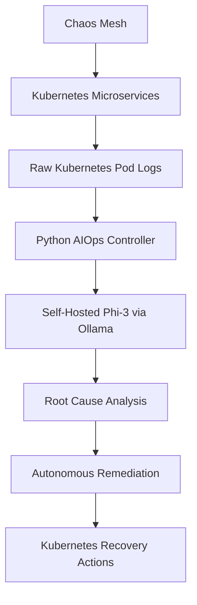

# 🚀 Privacy-Preserving Autonomous AIOps Using On-Premise Large Language Models

> Autonomous AI-powered Root Cause Analysis and Remediation Framework for Kubernetes using Self-Hosted LLMs and Chaos Engineering.

---

# 📌 Overview

Modern cloud-native applications deployed on Kubernetes increasingly rely on microservices architectures. While this improves scalability and flexibility, it also introduces significant operational complexity.

Microservices generate massive amounts of unstructured logs, and failures often appear as:
- latency spikes
- degraded performance
- cascading dependency failures
- partial outages

rather than explicit crashes.

Traditional monitoring systems can detect failures, but they often cannot explain:
- why the failure occurred
- which service caused it
- how to remediate it

This project explores whether a **self-hosted Large Language Model (LLM)** can perform:

- Root Cause Analysis (RCA)
- Failure reasoning
- Autonomous remediation

entirely on-premise without relying on external AI services.

The framework combines:
- Kubernetes
- Chaos Engineering
- Self-hosted LLMs
- Python automation

to build a privacy-preserving AIOps system for cloud-native environments.

---

# 🎯 Research Question

> Can a self-hosted, on-premise Large Language Model perform online root cause analysis over raw Kubernetes logs and autonomously remediate failures in a microservices environment without relying on cloud-based AI services?

---

# 🧠 Motivation

Traditional AIOps systems rely heavily on:
- static rules
- structured metrics
- supervised anomaly detection

These approaches struggle to generalize to:
- unknown failure modes
- changing system behavior
- cascading microservice failures

Recent approaches use cloud-hosted LLMs for log analysis and RCA. However, enterprise environments often prohibit sending:
- sensitive logs
- infrastructure details
- internal configurations

to external AI services.

This project investigates whether intelligent RCA and remediation can be achieved locally using self-hosted LLMs while preserving operational privacy.

---

# 🔐 Why Self-Hosted LLMs?

Enterprise systems often contain:
- sensitive logs
- internal infrastructure data
- deployment configurations
- customer-related metadata

Sending such data to external AI providers may violate:
- compliance policies
- security regulations
- organizational governance

This project uses:
- **Phi-3**
- **Ollama**

running completely on-premise to ensure:

✅ Data Privacy  
✅ Offline AI Reasoning  
✅ Enterprise-Safe Operations  
✅ No External API Dependency

---

# 🏗️ System Architecture



---

# ⚙️ Core Components

| Component | Technology |
|---|---|
| Container Orchestration | Kubernetes (kind) |
| Microservices Benchmark | Google Online Boutique |
| Chaos Engineering | Chaos Mesh |
| AI Reasoning | Phi-3 |
| LLM Runtime | Ollama |
| Automation Controller | Python |
| Infrastructure | Docker |

---

# 🔄 Relationship with Kubernetes Auto-Healing

Kubernetes provides built-in mechanisms such as:
- pod restarts
- replica reconciliation
- declarative rollbacks

These mechanisms ensure infrastructure-level health.

However, Kubernetes does not:
- perform semantic reasoning
- identify root causes
- understand application-level failures
- diagnose cascading degradation

Example:

All pods may remain in a `Running` state while:
- response latency increases
- inter-service communication slows down
- partial outages occur

This project operates above Kubernetes as an intelligent reasoning layer capable of:
- interpreting failures
- identifying faulty services
- making remediation decisions

---

# 🧩 System Workflow

## 1️⃣ Fault Injection

Chaos Mesh injects controlled failures into Kubernetes services.

Examples:
- network latency
- service disruption
- pod failures
- packet loss

---

## 2️⃣ Log Collection

The controller continuously collects:
- Kubernetes pod logs
- service events
- runtime outputs

using Kubernetes-native commands.

Example:

```bash
kubectl logs <pod-name>
```

---

## 3️⃣ Intelligent Log Parsing

A Python-based parser extracts:
- timestamps
- service names
- error messages
- contextual metadata

from raw unstructured logs.

---

## 4️⃣ AI-Powered Root Cause Analysis

Structured logs are sent to the local LLM together with a service knowledge map.

The LLM performs:
- contextual reasoning
- dependency analysis
- anomaly interpretation
- root cause identification

Example Prompt:

```txt
You are an SRE Assistant.

Analyze the following Kubernetes logs.
Identify:
- failing service
- probable root cause
- remediation recommendation
```

---

## 5️⃣ Autonomous Remediation

Based on LLM output, the controller executes constrained remediation actions using Kubernetes-native commands.

Examples:
- restarting deployments
- recreating pods
- rollout restart

Example:

```bash
kubectl rollout restart deployment payment-service
```

---

# 🧪 Experimental Setup

Experiments are conducted in a controlled environment using:

- VM-hosted kind cluster
- Google Online Boutique microservices application
- Chaos Mesh
- Python-based AIOps controller
- Self-hosted Phi-3 LLM via Ollama

The framework relies exclusively on:
- raw Kubernetes logs
- contextual reasoning
- local AI inference

without requiring:
- distributed tracing
- predefined failure signatures
- cloud-hosted AI APIs

---

# 📊 Evaluation Metrics

The system is evaluated using:

| Metric | Description |
|---|---|
| RCA Accuracy | Correct identification of faulty service |
| MTTR | Mean Time To Recovery |
| False Remediation Rate | Incorrect remediation actions |
| Autonomy Rate | Percentage of failures resolved autonomously |

---

# 🚀 Key Features

## ✅ Privacy-Preserving AIOps
All AI reasoning happens locally.

---

## ✅ Self-Hosted LLM-Based RCA
Root cause analysis using local LLM inference.

---

## ✅ Chaos Engineering Integration
Controlled fault injection for resilience testing.

---

## ✅ Autonomous Remediation
Closed-loop recovery using Kubernetes-native commands.

---

## ✅ Schema-Agnostic Log Analysis
Works directly on raw unstructured logs.

---

# 📂 Project Structure

```bash
privacy-preserving-aiops/
│
├── chaos-testing/
│   ├── network-latency.yaml
│   ├── pod-failure.yaml
│
├── controller/
│   ├── controller.py
│   ├── remediation_engine.py
│
├── parser/
│   ├── log_parser.py
│
├── llm/
│   ├── ollama_client.py
│
├── scripts/
│   ├── deploy.sh
│
├── requirements.txt
├── README.md
└── LICENSE
```

---

# 🔧 Installation & Setup

## 📋 Prerequisites

Install:
- Docker
- kind
- kubectl
- Helm
- Python 3.x
- Ollama

---

# 🛠️ Step 1 — Create Kubernetes Cluster

```bash
kind create cluster --name aiops-cluster
```

---

# 🛠️ Step 2 — Install Chaos Mesh

```bash
helm repo add chaos-mesh https://charts.chaos-mesh.org

helm install chaos-mesh chaos-mesh/chaos-mesh \
-n chaos-testing \
--create-namespace
```

---

# 🛠️ Step 3 — Deploy Online Boutique

```bash
kubectl apply -f kubernetes-manifests.yaml
```

---

# 🛠️ Step 4 — Install Ollama & Phi-3

```bash
ollama pull phi3
```

Run locally:

```bash
ollama run phi3
```

---

# 🛠️ Step 5 — Install Python Dependencies

```bash
pip install -r requirements.txt
```

---

# 🛠️ Step 6 — Start AIOps Controller

```bash
python3 controller.py
```

---

# 📈 Example RCA Output

```txt
===================================
AI ROOT CAUSE ANALYSIS REPORT
===================================

Affected Service:
payment-service

Detected Issue:
Timeout while communicating with cart-service

Probable Root Cause:
Injected network latency caused delayed responses from cart-service.

Suggested Remediation:
Restart affected deployment and verify internal service communication.

Severity:
HIGH
```

---

# 📸 Recommended Screenshots

Create a `/screenshots` folder and include:
- Kubernetes pod status
- Chaos Mesh experiments
- AI RCA terminal output
- Ollama running locally
- Fault injection results

Example:

```md

```

---

# 🎥 Recommended Demo

A short demo video can show:
1. Chaos injection
2. Service degradation
3. AI RCA detection
4. Autonomous remediation
5. System recovery

---

# 💡 Key Contributions

This work contributes:

1. Privacy-preserving on-premise AIOps framework
2. Self-hosted LLM-powered root cause analysis
3. Schema-agnostic reasoning over raw logs
4. Autonomous Kubernetes remediation
5. Chaos-driven evaluation methodology

---

# ⚠️ Limitations

Current limitations include:
- single-fault focused evaluation
- constrained remediation strategies
- dependency on log quality
- controlled laboratory environment
- limited reasoning capacity of local LLM

---

# 🔮 Future Enhancements

- Multi-fault handling
- Cascading failure analysis
- Auto-scaling remediation
- Traffic shifting
- Confidence scoring
- Human-in-the-loop validation
- Multi-cluster support

---

# 📚 Learning Outcomes

This project provided hands-on experience with:
- Kubernetes Administration
- AIOps Architecture
- Chaos Engineering
- Site Reliability Engineering (SRE)
- AI + Infrastructure Integration
- Cloud-Native Systems
- Autonomous Remediation

---

# 🌍 Real-World Applications

Potential enterprise applications include:
- FinTech infrastructure
- SaaS platforms
- Enterprise Kubernetes operations
- Cloud reliability engineering
- Large-scale microservices environments

---

# 👨‍💻 Author

## Manish Thakur

Computer Science & Engineering  
DevOps | Kubernetes | Cloud | AIOps | DevSecOps Enthusiast

---

# 📜 License

This project is licensed under the MIT License.

---

# ⭐ Support

If you found this project useful:
- Star the repository
- Fork the project
- Open issues
- Contribute improvements

---

# 🏷️ Suggested Repository Topics

```txt
aiops
kubernetes
ollama
phi3
chaos-engineering
microservices
root-cause-analysis
cloud-native
sre
python
kind
observability
autonomous-remediation
```

---

# 📌 Conclusion

This project demonstrates the feasibility of secure, on-premise, LLM-driven root cause analysis and autonomous remediation in Kubernetes-based microservices environments.

By combining:
- Chaos Engineering
- self-hosted LLMs
- Kubernetes-native automation
- local AI reasoning

the framework establishes a foundation for privacy-preserving enterprise-grade AIOps research.
